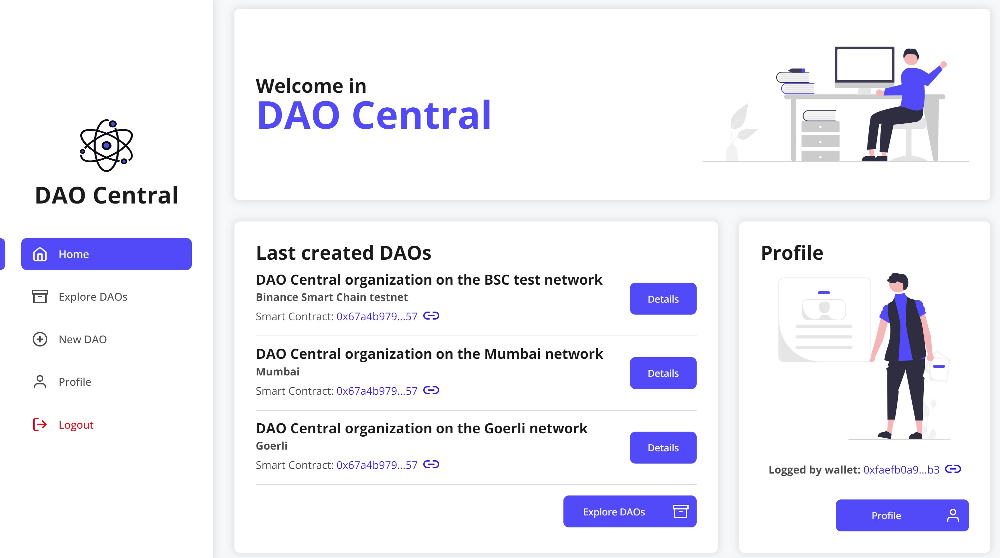
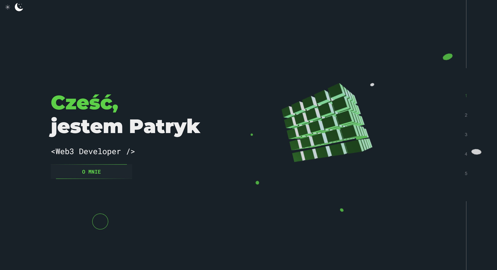

# Hi 👋, I'm Patryk Mróz, Full-stack web3 developer from Poland 🇵🇱

## Main skills

⭐ Front-end development - React, Next.js, TypeScript

⭐ Back-end development - NestJs, Express.js, Node.js, TypeScript

⭐ Blockchain development - Solidity, Hardhat

## Last projects

### DAO Central

The decentralized application powered by blockchain technology for creating and managing DAOs (decentralized autonomous organizations). **Tech stack: Next.js, NestJS, Solidity, TypeScript.**

#### 👉 [LIVE: DAO Central app](https://dao-central.vercel.app)

#### 👀 [REPOSITORY OF CODE: DAO Central app](https://github.com/patrykmroz619/dao-central)

### Personal website

The project of my personal website

#### 👉 [LIVE: patrykmroz.pl](https://patrykmroz.pl)

## Connect with me

⭐ Linkedin: [Patryk Mróz](https://www.linkedin.com/in/patryk-mroz/)

⭐ More details: [patrykmroz.pl](https://patrykmroz.pl)
